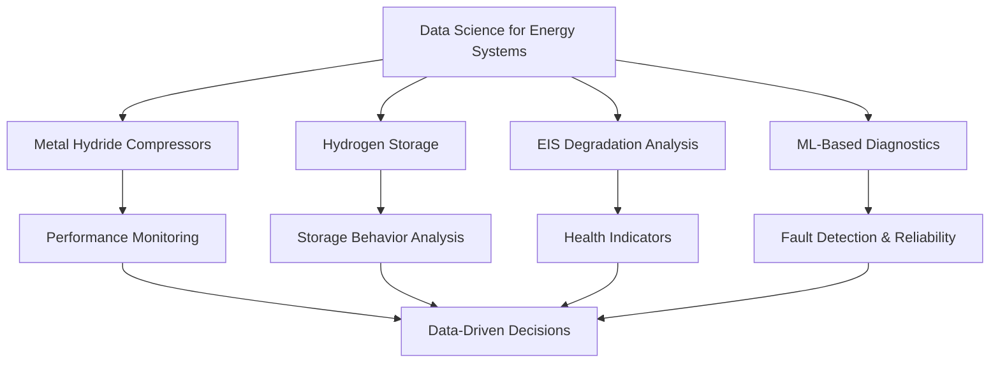

<!-- ══════════════════════════════════════════════════════════════════ -->
<!--                    PANKAJ RAJORIA — GitHub Profile README         -->
<!-- ══════════════════════════════════════════════════════════════════ -->

<div align="center">


</div>

<div align="center">

[](https://git.io/typing-svg)

</div>

<div align="center">

<a href="https://linkedin.com/in/rajoriapankaj" target="_blank">
  
</a>
<a href="mailto:pankaj.rajoria@gmx.de" target="_blank">
  
</a>
<a href="https://github.com/psrajoria" target="_blank">
  
</a>


</div>

<br>

<div align="center">


</div>

---

## 👋 About Me


I am **Pankaj Rajoria**, a **Data Scientist and ML Engineer** based in **Braunschweig, Germany**. I work at the intersection of **machine learning, data engineering, signal processing, and energy systems research**.

My current research focuses on **metal hydride compressors**, **hydrogen storage systems**, and **EIS-based degradation analysis**. I use data-driven methods to understand system behavior, detect performance degradation, improve reliability, and support intelligent diagnostics for sustainable energy technologies.

```python
class PankajRajoria:
    def __init__(self):
        self.role = "Data Scientist | ML Engineer | Research Assistant"
        self.location = "Braunschweig, Germany 🇩🇪"
        self.education = "M.Sc. Data Science — TU Braunschweig"
        self.experience = "4+ years across industry and research"

        self.current_research = [
            "Metal Hydride Compressors",
            "Hydrogen Storage Systems",
            "EIS-Based Degradation Analysis",
            "Data-Driven Diagnostics for Energy Systems"
        ]

        self.core_strengths = [
            "Machine Learning",
            "Signal Processing",
            "Data Engineering",
            "NLP & OCR",
            "BI & Analytics",
            "Python Automation"
        ]

    def mission(self):
        return "Turning complex sensor data into reliable engineering decisions."

me = PankajRajoria()
print(me.mission())
```

---

## 🔭 Currently Working On

<div align="center">

| Research Area | What I Do | Goal |
|:---:|:---|:---|
| ⚙️ **Metal Hydride Compressors** | Analyze performance data, operating behavior, and system patterns | Improve efficiency, reliability, and monitoring |
| 🧪 **Hydrogen Storage Systems** | Study storage-related measurements and process signals | Support sustainable energy system development |
| 🔋 **EIS Degradation Analysis** | Work with Electrochemical Impedance Spectroscopy data | Detect degradation, health changes, and fault indicators |
| 🧠 **ML Diagnostics** | Build classification, prediction, and anomaly-detection workflows | Enable intelligent condition monitoring |
| 📊 **Data Pipelines** | Clean, transform, validate, and model experimental data | Create reproducible and scalable analysis workflows |

</div>

---

## 🚀 What I Bring

<table>
<tr>
<td width="50%">

### 🤖 Machine Learning & AI

- End-to-end ML workflows from raw data to deployable insights
- Classification, regression, time-series analysis, and anomaly detection
- Deep learning with **PyTorch**, **TensorFlow**, and **Keras**
- Feature engineering for experimental and sensor-based datasets
- EIS and signal-based fault/degradation analysis

</td>
<td width="50%">

### 🏗️ Data Engineering

- ETL pipeline development using **Python**, **SQL**, and Informatica
- Data cleaning, validation, plausibility checks, and automation
- Time-series preprocessing and signal transformation
- REST API-driven data collection and backend development
- Reproducible workflows for research and industry datasets

</td>
</tr>
<tr>
<td width="50%">

### 📊 Analytics & Visualization

- Power BI dashboards and analytical reporting
- Experimental data exploration and performance monitoring
- Statistical analysis and decision-support dashboards
- Excel Power Query, R visualizations, and custom Python plots
- Translating technical results into clear business/research insights

</td>
<td width="50%">

### ☁️ Tools, Cloud & Automation

- AWS basics: S3, EC2, and cloud-based workflows
- Docker, Git, GitHub, GitLab, and reproducible environments
- Flask and Django applications for data collection and analysis
- Python GUI tools for reducing manual analysis effort
- Modular and maintainable code for research prototypes

</td>
</tr>
</table>

---

## 🛠️ Tech Stack

<div align="center">

### Core Tools


<br><br>

### Data Science · Engineering · Research


<br>


</div>

---

## 🧠 Research & Technical Interests

<div align="center">



</div>

---

## 🏆 Featured Projects

<table>
<tr>
<td width="33%" valign="top">

### 🔋 PEM Fuel Cell Fault Classification

Machine learning workflow for multi-class fault classification using impedance-based diagnostic data.

**Highlights**
- Macro F1-score: **0.9946**
- EIS-inspired feature analysis
- Fault classification and health monitoring
- Research-focused ML pipeline

**Tech:** Python · PyTorch · SciPy · scikit-learn

<a href="https://github.com/psrajoria">
  
</a>

</td>
<td width="33%" valign="top">

### 🛰️ Semantic Segmentation — ISPRS Potsdam

Pixel-level aerial image segmentation using deep learning models on high-resolution remote sensing datasets.

**Highlights**
- Semantic segmentation pipeline
- Computer vision for aerial imagery
- UNet-style deep learning workflow
- High-resolution geospatial data

**Tech:** TensorFlow · OpenCV · Python

<a href="https://deep-learning-igp-tubs-sose2023.github.io/Group_D/">
  
</a>

</td>
<td width="33%" valign="top">

### 🔩 Leakage Detection via Neural Networks

Neural-network-based leakage coordinate prediction using flow-rate sensor data.

**Highlights**
- Sensor-based regression workflow
- Coordinate prediction from flow data
- Custom neural network modelling
- Engineering-focused ML application

**Tech:** Keras · NumPy · Python

<a href="https://github.com/psrajoria/Leakage_detection">
  
</a>

</td>
</tr>
</table>

---

## 💼 Experience Snapshot

<div align="center">

| Period | Role | Organization | Focus |
|:---:|:---|:---|:---|
| **08/2025 – Present** | Research Assistant — ML & Data Analysis | TU Braunschweig · Institute for ICE & Fuel Cells | Metal hydride compressors, hydrogen storage, EIS degradation, ML diagnostics |
| **04/2024 – 09/2025** | Student Assistant — Data Engineering & NLP | TU Braunschweig · Institute of Economics | OCR pipelines, Flask app, fairness/bias analysis, NLP workflows |
| **07/2022 – 09/2025** | Student Assistant — Data Modelling & Optimization | TU Braunschweig · Institute of Controlling | Healthcare network modelling, DEA, R visualizations |
| **01/2023 – 03/2024** | Student Assistant — Data Engineering | TU Braunschweig · Energy & Process Systems Engineering | ETL pipelines, wavelet signal processing, time-series ML |
| **02/2019 – 11/2021** | Systems Engineer | Tata Consultancy Services, Delhi | Enterprise ETL, Power BI, Django REST APIs, PL/SQL |

</div>

---

## 🎓 Education

<div align="center">

| Degree | Institution | Year |
|:---:|:---|:---:|
| **M.Sc. Data Science** | Technische Universität Braunschweig 🇩🇪 | 2021 – 2025 |
| **B.Tech Electronics & Communication Engineering** | GGSIPU — Bharati Vidyapeeth, New Delhi 🇮🇳 | 2014 – 2018 |

</div>

---

## 📊 GitHub Analytics

<div align="center">

<table>
<tr>
<td>

</td>
<td>

</td>
</tr>
</table>


<br><br>


</div>

---

## 🏅 Highlights & Impact

<div align="center">

| Achievement | Impact |
|:---:|:---|
| 🔥 **4+ Years Experience** | Industry + academic research in data, ML, and engineering systems |
| 🤖 **High-Performance ML** | Achieved **0.9946 Macro F1-score** in fault classification research |
| 📉 **Noise Reduction** | Reduced data noise by approximately **40%** through preprocessing workflows |
| ⏱️ **Automation** | Cut manual analysis time by approximately **60%** using Python-based tools |
| 🐛 **Data Quality** | Reduced manual data errors by approximately **50%** with validation workflows |
| ⚡ **Pipeline Efficiency** | Improved preprocessing speed by approximately **30%** in signal data pipelines |
| 🌍 **Multilingual** | English · German · Hindi · Punjabi |

</div>

---

## 🌱 Beyond the Code

- I enjoy building practical tools that make complex engineering data easier to understand.
- I like working where **research, software, and real-world systems** meet.
- I am especially interested in **energy systems**, **hydrogen technologies**, **condition monitoring**, and **explainable machine learning**.
- I believe good data science is not only about models — it is about **reliable data, meaningful features, clear interpretation, and measurable impact**.

---

## 🤝 Let’s Connect

<div align="center">

I am always open to discussing **data science**, **machine learning**, **energy systems**, **EIS analysis**, **hydrogen storage**, and **research collaborations**.

<br>

<a href="https://linkedin.com/in/rajoriapankaj" target="_blank">
  
</a>
<a href="mailto:pankaj.rajoria@gmx.de" target="_blank">
  
</a>
<a href="https://github.com/psrajoria" target="_blank">
  
</a>

</div>

---

<div align="center">

### 💡 *"Elevate yourself through the power of your mind, and not degrade yourself, for the mind can be the friend and also the enemy of the self."*
#### — Bhagavad Gita, Chapter 6, Verse 5

<br>


</div>
